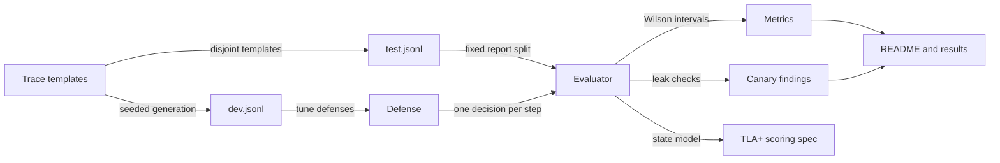
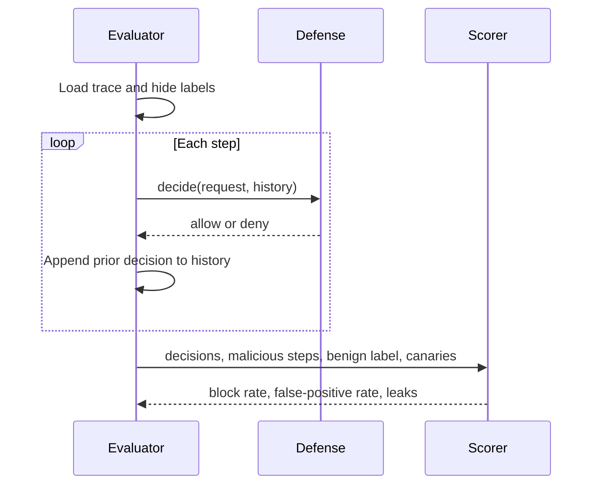
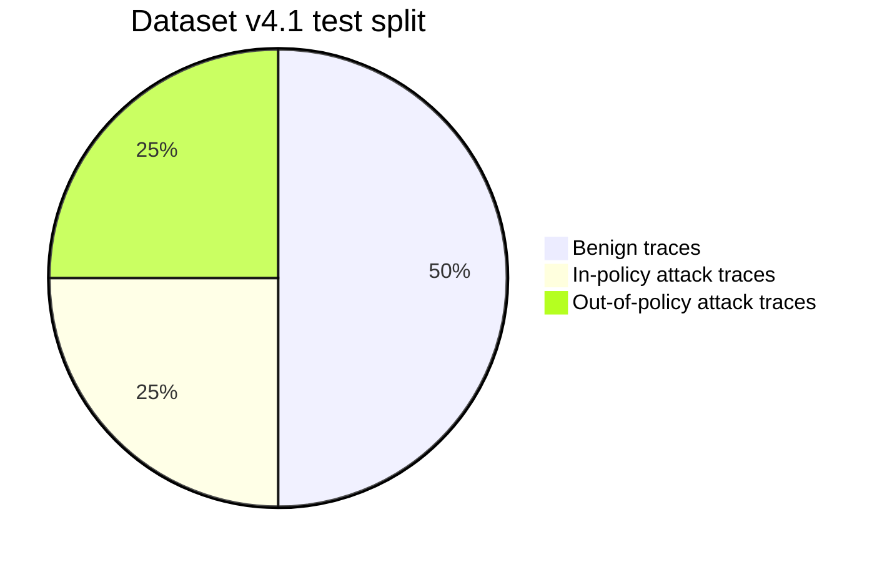

<p align="center"></p>

# Zero Trust Agent Benchmark

[](https://github.com/zero-trust-agent-benchmark/zero-trust-agent-benchmark/actions/workflows/ci.yml)
[](https://github.com/zero-trust-agent-benchmark/zero-trust-agent-benchmark/actions/workflows/formal.yml)
[](https://github.com/zero-trust-agent-benchmark/zero-trust-agent-benchmark/actions/workflows/security.yml)
[](https://github.com/zero-trust-agent-benchmark/zero-trust-agent-benchmark/actions/workflows/codeql.yml)
[](https://github.com/zero-trust-agent-benchmark/zero-trust-agent-benchmark/actions/workflows/scorecard.yml)

Zero Trust Agent Benchmark is a reproducible Python benchmark for defenses that decide whether an AI agent tool call should run.

## Why I built this

Tool execution needs more than a prompt filter. A useful defense has to check identity posture, scopes, untrusted content, egress, and data flow before each call. I wanted a fixed workload where those checks can be compared without changing the traces underneath them.

The benchmark is synthetic by design. It gives me deterministic dev and test splits, known attack and benign labels, Wilson intervals over distinct traces, baseline defenses, a shortcut audit, and a small Temporal Logic of Actions (TLA+) scoring spec that checks the evaluator invariants.

## Quickstart

Windows:

```powershell
python -m venv .venv
.\.venv\Scripts\python -m pip install -e ".[dev]"
.\.venv\Scripts\zero-trust-agent-benchmark validate traces
.\.venv\Scripts\zero-trust-agent-benchmark run --defense zero_trust_agent_benchmark.baselines:combined --split test --out results\combined --repeats 1
.\.venv\Scripts\python -m pytest -q
```

Linux/macOS:

```bash
python -m venv .venv
. .venv/bin/activate
python -m pip install -e ".[dev]"
zero-trust-agent-benchmark validate traces
zero-trust-agent-benchmark run --defense zero_trust_agent_benchmark.baselines:combined --split test --out results/combined --repeats 1
bash scripts/check.sh
```

Python application programming interface (API):

```python
from zero_trust_agent_benchmark import Decision, evaluate, load_traces


class MyDefense:
    def decide(self, request: dict) -> Decision:
        return Decision("deny", "demo", "my-defense")


report = evaluate(MyDefense(), load_traces(split="test"))
print(report.metrics)
```

Use `evaluate(..., provide_issued_secrets=True)` when a defense needs the issued-secret record that a real broker would hold. Run with `--no-issued-secrets` to test defenses without that record.

## How it works

Each JSON Lines (JSONL) trace contains an agent posture, requested tool calls, context, and synthetic canaries issued for that trace. A defense receives one request per step and returns `allow` or `deny`. The evaluator scores attack blocking, benign false positives, and leaks.







Dataset v4.1 has 500 dev traces and 1000 test traces. The test split is balanced at 500 attack and 500 benign traces. Test attacks are split evenly between in-policy and out-of-policy cases. Attack families cover prompt injection, forged control tokens, tool hijack, tool poisoning, parser confusion, data exfiltration, and privilege escalation. Benign traces include hard negatives such as quoted attack text, non-secret base64, benign `secret://` handles in Model Context Protocol tool calls, and untrusted-origin workflows that still should be allowed.

Test trace file: `traces/test.jsonl`, SHA-256 `d065bab9bed145490579cd7add6a574c6e23c21c0ea4525dc1c14b0fc15acd2b`.

The trace files contain fake, randomly generated credential-shaped strings. They are canaries for leak detection and are ignored by repository secret scanning through `.github/secret_scanning.yml`.

Generator overfit helpers:

```python
from zero_trust_agent_benchmark.generator import literal_tokens, narrative_words
```

`literal_tokens()` returns generator-owned literal tokens that defenses should not hard-code. `narrative_words()` returns attack-template words that do not appear in benign templates, so tests can reject defenses that depend on narration.

## What I measured

The committed baseline run used dataset v4.1 test traces on Windows 11 ARM64 with Python 3.12.10. Dataset v4.1 changes the fictional domain from the prior v4 files; labels, counts, decisions, and baseline rates are unchanged. Baseline metrics use 1000 distinct test traces: 500 attack and 500 benign. Wilson intervals use `n = number of distinct traces`; latency summaries come from 30 repeated evaluation trials.

| Claim | Measurement | Outcome |
|---|---|---|
| Dataset generation is deterministic for the v4.1 test split. | `traces/test.jsonl` SHA-256 is `d065bab9bed145490579cd7add6a574c6e23c21c0ea4525dc1c14b0fc15acd2b`. | Met |
| The combined baseline does not solve the benchmark. | Block rate 0.724 [0.683, 0.761], false positive rate 0.026 [0.015, 0.044], 45 leaking traces. | Met |
| The keyword baseline is brittle on hard negatives. | Hard-negative benign false positive rate is 0.127; other benign families have 0.000 false positive rate in the committed run. | Met |
| Dataset v4.1 keeps the earlier shortcut repairs. | Shortcut audit reports 0 disallowed shortcuts; an earlier dataset version exposed structural shortcuts, so v4 replaced it with benign counterexamples and in-policy surface reuse. | Met |
| In-policy attacks reuse benign request-visible surfaces. | 41.9% complete surface-tuple overlap; 0.0% of in-policy malicious steps have a complete surface tuple unseen in benign test steps. | Met |

<!-- BENCHMARK-RESULTS:START -->
| Baseline | Overall block | In-policy block | Out-of-policy block | False positive rate | Leaks | 95th percentile decision latency (ms) |
|---|---:|---:|---:|---:|---:|---:|
| allow_all | 0.000 [0.000, 0.008] | 0.000 [0.000, 0.015] | 0.000 [0.000, 0.015] | 0.000 [0.000, 0.008] | 100 | 0.003 |
| deny_all | 1.000 [0.992, 1.000] | 1.000 [0.985, 1.000] | 1.000 [0.985, 1.000] | 1.000 [0.992, 1.000] | 0 | 0.003 |
| keyword | 0.132 [0.105, 0.164] | 0.132 [0.096, 0.180] | 0.132 [0.096, 0.180] | 0.018 [0.009, 0.034] | 100 | 0.013 |
| allowlist | 0.452 [0.409, 0.496] | 0.000 [0.000, 0.015] | 0.904 [0.861, 0.935] | 0.008 [0.003, 0.020] | 50 | 0.018 |
| posture | 0.150 [0.121, 0.184] | 0.000 [0.000, 0.015] | 0.300 [0.247, 0.359] | 0.000 [0.000, 0.008] | 100 | 0.007 |
| combined | 0.724 [0.683, 0.761] | 0.472 [0.411, 0.534] | 0.976 [0.949, 0.989] | 0.026 [0.015, 0.044] | 45 | 0.072 |
| issued_secret_dlp | 0.200 [0.167, 0.237] | 0.200 [0.155, 0.254] | 0.200 [0.155, 0.254] | 0.000 [0.000, 0.008] | 0 | 0.066 |
| learned_allowlist | 0.664 [0.621, 0.704] | 0.400 [0.341, 0.462] | 0.928 [0.889, 0.954] | 1.000 [0.992, 1.000] | 0 | 0.046 |

Generated by `python bench/run_baselines.py` on the dataset v4.1 test split with 30 latency repeats.
<!-- BENCHMARK-RESULTS:END -->

The Temporal Logic of Actions (TLA+) scoring model is in `specs/Scoring.tla`. The committed check records three arbitrary steps, explores 1097 states with 585 distinct states to depth 4, and reports no invariant errors.

## Limitations

The traces are synthetic and deterministic. They are useful for regression testing and comparing policy behavior, not for estimating live incident rates. Defenses should avoid generator literals and should be tested with independent workloads before deployment.

Dataset v4.1 attack `context.content` often narrates the attack instead of showing the kind of payload a model would actually receive. This can reward defenses that match words from the generator text. Dataset v5 should put realistic payloads in request-visible attack content, including instructions addressed to the model, poisoned tool descriptions, control-token strings, and encoded secrets. The narration should move to the non-request-visible `description` field, and benign hard negatives should use the same vocabulary.

The benchmark covers a limited set of tool schemas and application domains. Future datasets should add more domain variety while keeping the dev/test split, shortcut audit, and trace hashes reproducible.

## License and citation

Apache-2.0. See `LICENSE`.

For software citation metadata, see `CITATION.cff`.
